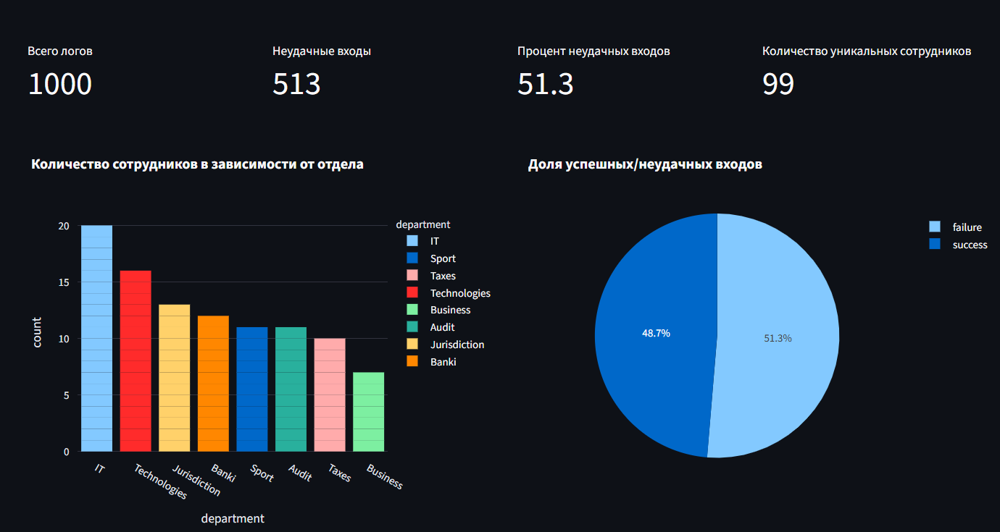
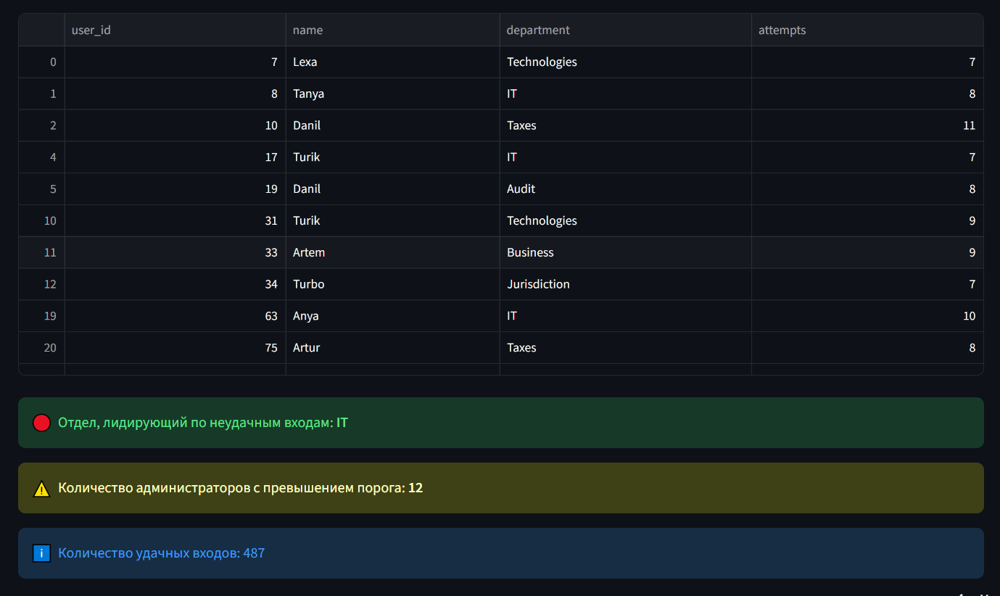

# Incident dashboard

Разработан интерактивный дашборд на Streamlit, который позволяет в реальном времени анализировать логи доступа и выявлять риски.
Реализована полная цепочка: генерация тестовых данных, очистка и объединение таблиц, визуализация, фильтрация и деплой на Streamlit Cloud.
Проект демонстрирует навыки работы с данными, построения отчётов и создания веб-приложений для бизнес-задач.

## Демо
[Ссылка на дашборд](https://incidentdashboardgit-lg9zjavhfgpqjypngvzgvp.streamlit.app/)

## Скриншоты

## Возможности
- Фильтрация по отделу, уровню доступа и датам
- Разные типы визуализации
- Метрики по неудачным входам

## Технологии
- Python 3.10
- Streamlit
- Pandas
- Plotly

## Установка и запуск
1. Клонировать репозиторий
2. Создать виртуальное окружение
3. Установить зависимости
4. Запустить

## Структура проекта
app.py              — главный дашборд  
gen_data.py         — скрипт генерации данных  
.csv                — данные для дашборда  
requirements.txt    — зависимости
